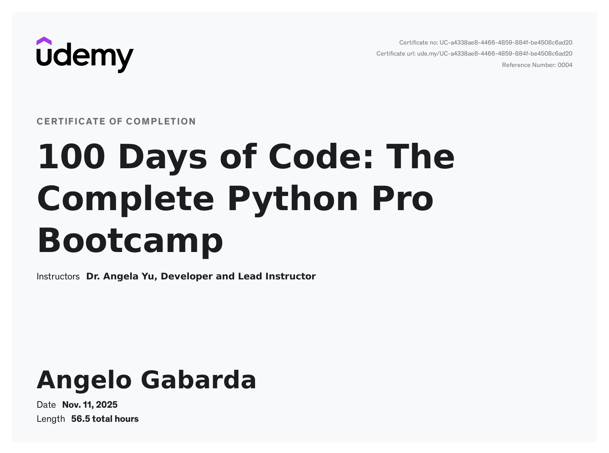
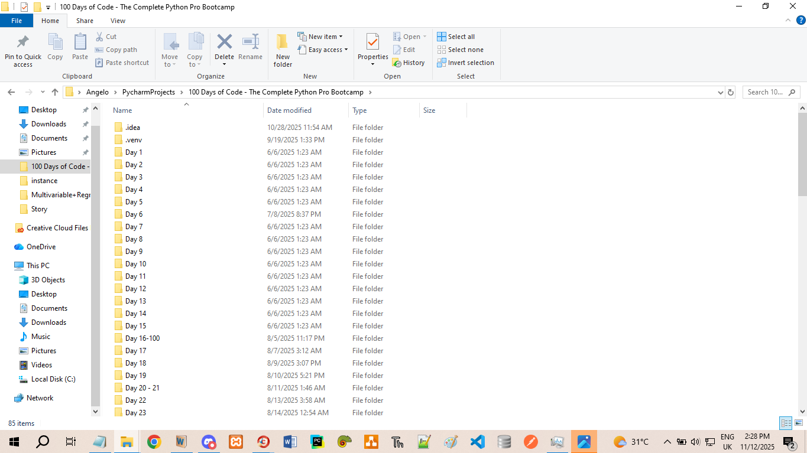

# 100 Days of Code: The Complete Python Pro Bootcamp

## Overview
**Completed:** November 11, 2025  
**Duration:** 56.5 hours  
**Projects:** 100 real-world Python apps  
**Instructor:** Dr. Angela Yu  
**Platform:** [The App Brewery](https://appbrewery.com)

> **Certificate ID:** `UC-a4338ae8-4466-4859-884f-be4508c6ad20`  
> **Reference:** `0004`  
> [View Certificate](https://ude.my/UC-a4338ae8-4466-4859-884f-be4508c6ad20)

---

## Course Syllabus

### Beginner Python (Days 1–14)
- Variables, Data Types, Input/Print
- Math Operations, Type Conversion
- Conditionals, Logical Operators
- Loops, Random Module, Error Handling
- Functions, Scope, Debugging
- Lists, Dictionaries, Nested Data

### Intermediate Python (Days 15–30)
- PyCharm Setup, OOP (Classes, Inheritance)
- Turtle Graphics, Game Dev
- File I/O, CSV, Pandas Intro
- List/Dict Comprehensions

### Intermediate+ (Days 31–55)
- Tkinter GUI Apps
- APIs, JSON, SMTP Email
- Web Scraping (Beautiful Soup)
- Selenium Automation (Tinder, Twitter, LinkedIn)
- Flask, Jinja2, WTForms
- PythonAnywhere Deployment

### Advanced Python (Days 56–80)
- REST APIs, SQLite, SQLAlchemy
- Pandas: Cleaning, Pivot Tables, Time Series
- Matplotlib, Seaborn, Plotly
- NumPy, Scikit-Learn: Regression, Stats
- Jupyter, Data Visualization

### Professional Portfolio (Days 81–100)
Capstone projects built from scratch:
- Live websites
- Automation bots
- Data dashboards
- ML predictions

---

## All 100 Projects

| Day | Project | Key Skills |
|-----|-------|-----------|
| 1 | Band Name Generator | `input()`, string concat |
| 2 | Tip Calculator | Math, `round()`, f-strings |
| 3 | Treasure Island | `if/elif/else`, flowcharts |
| 4 | Rock Paper Scissors | `random`, lists |
| 5 | Password Generator | Loops, `random.choice()` |
| 6 | Reeborg’s Maze | Functions, indentation |
| 7 | Hangman | `while`, list mutation |
| 8 | Caesar Cipher | Functions, args |
| 9 | Secret Auction | Dictionaries, `max()` |
| 10 | Calculator | Recursion, return |
| 11 | Blackjack | Complex logic |
| 12 | Number Guessing | Scope, constants |
| 13 | Debugging | `print`, debugger |
| 14 | Higher Lower | Game loop |
| 15 | Coffee Machine (OOP) | Classes, methods |
| 16 | OOP Quiz | Inheritance |
| 17 | Hirst Painting | Turtle, color |
| 18 | Turtle Race | Events, state |
| 19–21 | Snake Game | OOP, food, score |
| 22 | Pong Game | Collision, physics |
| 23 | Turtle Crossing | Sprites, levels |
| 24 | Mail Merge | File I/O |
| 25 | US States Game | Pandas, CSV |
| 26 | NATO Alphabet | Comprehensions |
| 27 | Tkinter Basics | Widgets |
| 28 | Pomodoro Timer | `after()`, UI |
| 29–30 | Password Manager | JSON, search |
| 31 | Flash Card App | Random rows |
| 32 | Birthday Emailer | `smtplib` |
| 33 | ISS Notifier | API, time |
| 34 | Quizzer GUI | Dynamic UI |
| 35 | Rain Alert | Twilio SMS |
| 36 | Stock News | NewsAPI |
| 37 | Habit Tracker | Pixela API |
| 38 | Workout Logger | Nutritionix |
| 39–40 | Flight Deals | Tequila, Sheety |
| 41–42 | Personal Site | HTML/CSS |
| 43 | Billboard → Spotify | Scraping + API |
| 44 | Movie List Site | Flask, DB |
| 45 | Top 100 Movies | BS4 |
| 46 | Spotify Playlist | Spotipy |
| 47 | Amazon Tracker | Price alert |
| 48 | Cookie Clicker Bot | Selenium |
| 49 | LinkedIn Apply Bot | Form fill |
| 50 | Tinder Swiper | Auto-swipe |
| 51 | Speed Twitter Bot | Speedtest |
| 52 | Instagram Follower | Comparison |
| 53 | Zillow → Forms | Data entry |
| 54 | Flask Hello World | Routes |
| 55 | Higher Lower Flask | URL params |
| 56 | Name Card Site | Bootstrap |
| 57 | Blog with Jinja | Loops |
| 58 | Portfolio Site | Responsive |
| 59–60 | Blog CRUD | SQLAlchemy |
| 61 | Flask Login | `flask_login` |
| 62 | Cafe WiFi | WTForms |
| 63 | Library DB | Admin |
| 64 | Top Movies | Edit/delete |
| 65 | Web Design | CSS Grid |
| 66–70 | REST API Blog | JSON, auth |
| 71–75 | Pandas Analysis | `.describe()` |
| 76 | LEGO Data | Grouping |
| 77 | Google Trends | Time series |
| 78 | NASA Charts | Matplotlib |
| 79 | Data Cleaning | `dropna()` |
| 80 | Seaborn Plots | Heatmaps |
| 81 | **Portfolio Website** | Live deploy |
| 82 | Tic Tac Toe GUI | Win logic |
| 83 | Image Watermark | PIL |
| 84 | Typing Speed | WPM |
| 85 | Breakout Game | Bricks |
| 86 | Snake Pro | High score |
| 87 | Cafe & WiFi Site | Search |
| 88 | Todo List | Session |
| 89 | Disappearing Text | Timer save |
| 90 | PDF → Audiobook | `pyttsx3` |
| 91 | Color Palette | `getcolors()` |
| 92 | Custom Scraper | Pagination |
| 93 | Dino Game Bot | `pyautogui` |
| 94 | Space Invaders | Pygame |
| 95 | API Blog | JWT |
| 96 | Online Shop | Cart |
| 97 | Browser Tool | Downloads |
| 98 | **Space Race Analysis** | Trends |
| 99 | **Police Incidents** | Dashboard |
| 100 | **Earnings Prediction** | Regression |

(LODDC 2.png)
(LODDC 3.png)
(LODDC 4.png)

(Syllabus+for+100+Days+of+Python.pdf)
